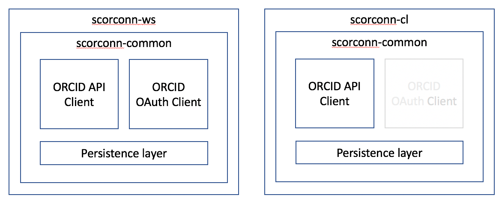

# Developer Notes for the Scholars-ORCID Connection (SCORconn)

## Structure
* The product comprises of two distinct applications:
	* `scorconn-ws` is an interactive web service. 
		* Users may interact with ORCID, granting SCORconn permission to add publications to their ORCID record.
		* Users may kick off an asynchronous update of the publications on their ORCID record.
	* `scorconn-cl` is a batch-oriented command-line application.
		* The administrator may initiate asynchronous updates for the publications of one or more users.
		* The users must have granted permission, via `scorconn-ws`.

* Both applications interact with Scholars and with ORCID.
	* If either Scholars or ORCID is offline, the application can't accomplish anything.

* Package structure
	* The applications share most of their code.
	
	* They rely on the `orcid-api-client` code, which is available as a Maven artifact from CUL-IT:

		```
	      <dependency>
	        <groupId>edu.cornell.library</groupId>
	        <artifactId>orcid-api-client</artifactId>
	        <version>1.0-SNAPSHOT</version>
	      </dependency>
		```
		* This artifact includes both the API client and the OAuth client. 
		This is why both are shown in the diagram, even though `scorconn-cl` doesn't use the OAuth client.
	

## Hibernate for persistence
* The `DataLayer` and related classes were clearly written by someone who barely understands how to use Hibernate.
* 

## Database design

* Diagram created using [QuickDBD](https://www.quickdatabasediagrams.com/)

	

* [Source file](./database_schema.txt)

### Person table
* Associates a local ID (NetID) with an OrcidId (and name). 
* Record is added when the user logs in to Scorconn and authenticates to ORCID.
* If a local ID maps to more than one OrcidID, log a warning and behave as if it maps to none at all.
	* In the web service, require authentication
	* In the batch process, do not attempt updates
		* Probably, the batch process should begin by scanning the table for multiple mappings, 
		and reporting a list of complaints.
* Otherwise, if there is more than one record for a local ID, use the most recent.

### Token table
* Holds all sorts of information about an access token. 
* Record is added when the user grants permission for a particular scope of access. 
* Record is replaced if the user rescinds permission, and then grants it again.
* Probably the only required information is ORCID\_ID, SCOPE, and ACCESS\_TOKEN. 
* The other fields may be useful for forensics. Orcid recommends that you store the JSON, for example.

### Work table
* Holds enough information so we can see what publications were pushed, and to whose account.
* Record is added when a publication is added.
* Record is replaced when a publication is updated.
* The HASH permits a fast compare between the version that was pushed, and the latest version from Scholars,
to determin whether an update is needed.

### LogEntry table
* Add a record for any change in the other tables, CATEGORY is add, update, or delete, and TABLE_ is work, 
person, or token.
* Add a record for other significant events (such as what?). CATEGORY is INFO or ERROR, and TABLE_ is none.

## Messages syntax

### Request to Scholars: Get Publications for user

#### Request URL
```
[scholarsURL]/dataRequest/listPublicationsForOrcidConnection?localID=[localID]
```
* Where:
	* `scholarsURL` - the base URL for scholars, e.g. `http://scholars.cornell.edu`
	* `localID` - the netID of the person, e.g. `jeb228`

#### Response

```
[
  {
    "workType": "journal-article",
    "title": "A model system for developing a tissue engineered meniscal enthesis",
    "publicationDate": "2018-01-01",
    "language": "en",
    "country": "US",
    "journalTitle": "Acta Biomaterialia",
    "externalIds": [
      {
        "type": "other-id",
        "url": "https://scholars.cornell.edu/display/UR-458129",
        "displayValue": "Scholars@Cornell URL"
      },
      {
        "type": "doi",
        "url": "http://dx.doi.org/10.1016/j.actbio.2016.10.040",
        "displayValue": "10.1016/j.actbio.2016.10.040"
      }
      ...
    ]
  }
  ...
]
```
* Where:
	* Only `workType` and `title` are required by ORCID. For our purposes, at least one `externalIds` must be present, providing the Scholars URL.
	* `workType` must be one of the types defined in [work-2.1.xsd](https://github.com/ORCID/ORCID-Source/blob/master/orcid-model/src/main/resources/record_2.0/work-2.0.xsd). For the initial implementation, it is always `journal-article`.
	* `publicationDate` is "fuzzy", so these are all valid `2018`, `2018-12`, `2018-04-16`.
	* `language`, if present, must be one of the values defined in [common-2.1.xsd](https://github.com/ORCID/ORCID-Source/blob/master/orcid-model/src/main/resources/common_2.1/common-2.1.xsd).
	* `country`, if present, must be one of the values defined in [common-2.1.xsd](https://github.com/ORCID/ORCID-Source/blob/master/orcid-model/src/main/resources/common_2.1/common-2.1.xsd).
	* `externalIds.type` must be one of the values defined in [the list of identifiers recognized by ORCID](https://pub.orcid.org/v2.0/identifiers).
		* For the Scholars URL, `type` must be `other-id`. `displayValue` is arbitrary, but `Scholars@Cornell URL` seems reasonable.
		* If available, add other external IDs, like `doi` or `isbn`.

### Request from Scholars: Get status of user

#### Request URL
```
[scorconnURL]/personStatus?localId=[netID]
```
* Where:
	* `scorconnURL` - the base URL for the Scholars-ORCID connection server,
   e.g. `http://scorconn.scholars.cornell.edu`
	* `netID` - the netID of the person, e.g. `jeb228`

#### Response
```
{
  "orcid_id": "1234-2345-3456-4567",
  "orcid_name": "Jim Blake",
  "orcid_page_url": "https://sandbox.orcid.org/1234-2345-3456-4567"
  "publications_pushed": 16,
  "last_update": "1239083124900"
}
```
* Where:
	* If they have given us access to their Orcid page at any time, all fields will be present.
	Otherwise, the structure will be empty.
	* `publications_pushed` may be 0 or more.
	* `last_update` is milliseconds past the epoch (long integer). 
	If `publications_pushed` is 0, `last_update` will be 0 also.

## The Authorization Filter
* __*TBD*__
* Not hooked up to CUWebAuth? Pretend

## Startup status
* __*TBD*__
* Another filter, how does it work, what does it do? Why is it good? (returns a 500)

## Application flow
* __*TBD*__
* _Is it reasonable to describe all of the paths through the application?_
* _Don't forget the completion URL (optional)_

## JAXB and the schemas
* __*TBD*__
* They come from here: [the record directory](https://github.com/ORCID/ORCID-Source/tree/master/orcid-model/src/main/resources/record_2.1) and [the common directory](https://github.com/ORCID/ORCID-Source/tree/master/orcid-model/src/main/resources/common_2.1)

* Copied them in, rather than accessing them remotely every time we build the project.

## Have the publications changed?
* When we obtain the list of a person's publications from Scholars@Cornell, how dop we know which ones to 
	* add to ORCID
	* update in ORCIR
	* delete from ORCID
	* ignore as unchanged

* The naive approach is "delete all existing pubs, then add all current ones."
	* This is too expensive in terms of unnecessary calls to the ORCID API.
	* What do we do instead?

* First cut:
	* Get the list of previous publications from ORCID. 
	* Get the list of current publications from Scholars. (`/works` summary)
	* Determine __add__s and __delete__s by comparing the lists.
		* Optionally, clean the database. Remove any publications that ORCID
		isn't aware of.
	
* Next, separate the __update__s from the __unchanged__.
	* Compare hashcodes between the current publications and the records in the
	database. Any matches become __unchanged__.
		* If a publication is not found in the database, it becomes an 
		__update__.

* With this approach, we could recreate the `Work` table in the database by
deleting it.
	* On the next pass, all __add__s and __update__s will be recorded. 
	* All the pubs that should have been __ignore__s will become __update__s
	and be recorded.

* Other approaches that were discarded:
	* __Ask ORCID__ -- get the details for each publication from ORCID, rather
	than relying on the database to know whether the publication has changed.
		* This is expensive in terms of reads against the API.
	* __Assume update__ -- never ignore a publication, do an update.
		* This is expensive in terms of writes against the API.

## Other docs
* [Acceptance tests](./ScorconnAcceptanceTesting.md)
* [To-do list](./Scorconn_TO_DO.md)